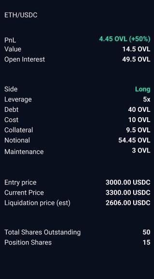

# Collateral Manager ERC1155 NFT Server

## Outstanding Task

- Implement metadata Python server for OpenSea, etc. to query


## References

- Good [Flask example](https://github.com/ProjectOpenSea/metadata-api-python/blob/master/app.py) for ERC-721 metadata from OpenSea
- [OpenSea standards](https://docs.opensea.io/docs/metadata-standards)
- [ERC-1155 spec](https://github.com/ethereum/EIPs/blob/master/EIPS/eip-1155.md#erc-1155-metadata-uri-json-schema)
- Our [`OverlayV1OVLCollateral.sol`](https://github.com/overlay-market/overlay-v1-core/blob/main/contracts/collateral/OverlayV1OVLCollateral.sol) contract from `overlay-v1-core`
- OpenZeppelin's [ERC-1155 implementation](https://github.com/OpenZeppelin/openzeppelin-contracts/blob/master/contracts/token/ERC1155/extensions/ERC1155Supply.sol) which our collateral managers inherit from
- [Forum post](https://forum.openzeppelin.com/t/create-an-erc1155/4433) from OpenZeppelin on creating an ERC-1155 token and validating associated metadata


## Requirements

- Must query the collateral manager contract for a particular position attributes with a given `positionId`
- Should return static position information for `positionId`:

    * Market
    * Side (long/short)
    * Leverage
    * Debt
    * Cost
    * Maintenance


- Should return dynamic position information for `positionId`:

    * Value (in OVL)
    * PnL (in OVL)
    * Notional (in OVL)
    * Collateral (in OVL)
    * Entry price
    * Current price
    * Liquidation price (est)


- Existing boilerplate [FastAPI](https://github.com/tiangolo/fastapi) server in [`overlay-market/markets-api`](https://github.com/overlay-market/markets-api)

- Example image of metadata displayed on UI for an ETH/USDC market:

    


### Implementation

Metadata server should expose an endpoint with params `address` of the collateral manager and `id` of the position

```
GET /collateral/{address}/position/{id}
```

which returns JSON data of the form

```
{
  "description": "Positions issued by the <collateral_type> collateral manager for Overlay V1 Core",
  "external_url": <external_url>,
  "image": <image_url>,
  "name": "<collateral_type> Collateral Manager",
  "attributes": [
    { "trait_type": "market", "value": "<market>" },
    { "trait_type": "side", "value": "<side>" },
    { "trait_type": "leverage", "value": "<leverage>" },
    { "trait_type": "debt", "value": <debt> },
    { "trait_type": "cost", "value": <cost> },
    { "trait_type": "maintenance", "value": <maintenance> },
    { "trait_type": "collateral", "value": <collateral> },
    { "trait_type": "value", "value": <value> },
    { "trait_type": "pnl", "value": <pnl> },
    { "trait_type": "notional", "value": <notional> },
    { "trait_type": "entry_price", "value": <entry_price> },
    { "trait_type": "current_price", "value": <current_price> },
    { "trait_type": "liquidation_price", "value": <liquidation_price> }
  ],
}
```
